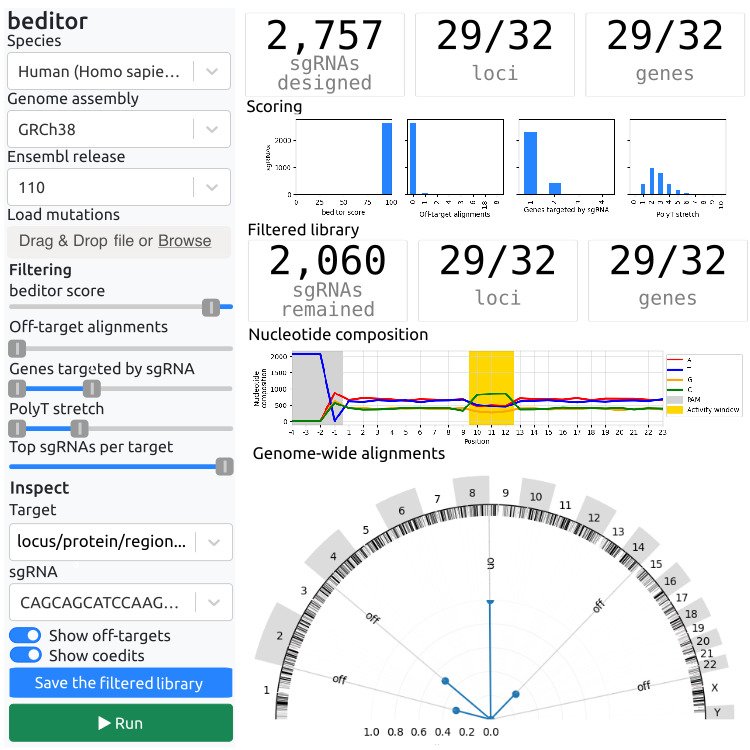

``beditor``([v2](#v2))<a href="#"></a>
====================
A Computational Workflow for Designing Libraries of sgRNAs for CRISPR-Mediated Base Editing, and much more
<!-- [![Contributors][contributors-shield]][contributors-url]
[![Forks][forks-shield]][forks-url]
[![Stargazers][stars-shield]][stars-url] -->
<a href="">[](https://pypi.org/project/beditor)</a>
<a href="">[](https://github.com/rraadd88/beditor/actions/workflows/build.yml)</a>
<a href="">[](https://github.com/rraadd88/beditor/issues)</a>
<a href="">[](https://pepy.tech/project/beditor)</a>
<a href="">[](https://github.com/rraadd88/beditor/blob/master/LICENSE)</a>

# Usage

## 🖱️ GUI-mode

```
beditor gui
```

[](#usage)

Note: GUI is recommended for designing small libraries and prioritization of the guides.

## ▶️ CLI-mode

```
beditor cli --editor BE1 -m path/to/mutations.tsv -o path/to/output_directory/ --species human --ensembl-release 110
or
beditor cli -c beditor_config.yml
```

<details>
  <summary>Parameters</summary>

    usage: beditor cli  [--editor EDITOR] [-m MUTATIONS_PATH] [-o OUTPUT_DIR_PATH]
                        [--species SPECIES] [--ensembl-release ENSEMBL_RELEASE]
                        [--genome-path GENOME_PATH] [--gtf-path GTF_PATH] [-r RNA_PATH] [-p PRT_PATH]
                        [-c CONFIG_PATH]
                        [--search-window SEARCH_WINDOW] [-n]
                        [-w WD_PATH] [-t THREADS] [-k KERNEL_NAME] [-v VERBOSE] [-i IGV_PATH_PREFIX] [--ext EXT] [-f] [-d] [--skip SKIP]
    
    optional arguments:
      -h, --help            show this help message and exit
      --editor EDITOR       base-editing method, available methods can be listed using command: 'beditor resources'
      -m MUTATIONS_PATH, --mutations-path MUTATIONS_PATH
                            path to the mutation file, the format of which is available at https://github.com/rraadd88/beditor/README.md#Input-format.
      -o OUTPUT_DIR_PATH, --output-dir-path OUTPUT_DIR_PATH
                            path to the directory where the outputs should be saved.
      --species SPECIES     species name.
      --ensembl-release ENSEMBL_RELEASE
                            ensemble release number.
      --genome-path GENOME_PATH
                            path to the genome file, which is not available on Ensembl.
      --gtf-path GTF_PATH   path to the gene annotations file, which is not available on Ensembl.
      -r RNA_PATH, --rna-path RNA_PATH
                            path to the transcript sequences file, which is not available on Ensembl.
      -p PRT_PATH, --prt-path PRT_PATH
                            path to the protein sequences file, which is not available on Ensembl.
      --search-window SEARCH_WINDOW
                            number of bases to search on either side of a target, if not specified, it is inferred by beditor.
      -n, --not-be          False
                            do not process as a base editor.
      -c CONFIG_PATH, --config-path CONFIG_PATH
                            path to the configuration file.
      -w WD_PATH, --wd-path WD_PATH
                            path to the working directory.
      -t THREADS, --threads THREADS
                            1
                            number of threads for parallel processing.
      -k KERNEL_NAME, --kernel-name KERNEL_NAME
                            'beditor'
                            name of the jupyter kernel.
      -v VERBOSE, --verbose VERBOSE
                            'WARNING'
                            verbose, logging levels: DEBUG > INFO > WARNING > ERROR (default) > CRITICAL.
      -i IGV_PATH_PREFIX, --igv-path-prefix IGV_PATH_PREFIX
                            prefix to be added to the IGV URL.
      --ext EXT             file extensions of the output tables.
      -f, --force           False
      -d, --dbug            False
      --skip SKIP           skip sections of the workflow
        
    Examples:
        
        
    Notes:
        Required parameters for assigning a species:
            species
            ensembl_release
            or
            genome_path
            gtf_path
            rna_path
            prt_path

</details>

# Installation
    
## Virtual environment and namming kernel (recommended)
```
conda env create -n beditor python=3.9;           # options: conda/mamba, python=3.9/3.8
python -m ipykernel install --user --name beditor
```

## Installation of the package
```
pip install beditor[all]                           
```

## Optional dependencies, as required:

```
pip install beditor                                # only cli
pip install beditor[gui]                           # plus gui
```

For fast processing of large genomes (highly recommended for human genome):

```
conda install install bioconda::ucsc-fatotwobit bioconda::ucsc-twobittofa bioconda::ucsc-twobitinfo # options: conda/mamba
```

Else, for moderately fast processing,

```
conda install install bioconda::bedtools           # options: conda/mamba
```

# Input format 

Note: The coordinates are 1-based (i.e. `X:1-1` instead of `X:0:1`) and IDs correspond to the chosen genome assemblies (e.g. from Ensembl).

Point mutations
```
chrom start  end strand mutation
    5  1123 1123 +      C
```
Position scanning
```
chrom start  end strand
    5  1123 1123 +     
```
Region scanning
```
chrom start  end strand
    5  1123 2123 +     
```
Protein point mutations
```
protein id aa pos mutation
  ENSP1123     43        S    
```
Protein position scanning
```
protein id aa pos
  ENSP1123     43    
```
Protein region scanning
```
protein id aa start aa end
  ENSP1123       43    143
```
Note: Ensembl protein IDs are used.  

# Output format

Note: output contains 0-based coordinates are used.

```
guide sequence          guide locus          offtargets score {columns in the input}
AGCGTTTGGCAAATCAAACAAAA 4:1003215-1003238(+)          0     1 ..
```

# Supported base editing methods

| method      | nucleotide | nucleotide mutation | window start | window end | guide length | PAM    | PAM position |
|-------------|------------|---------------------|--------------|------------|--------------|--------|--------------|
| A3A-BE3     | C          | T                   | 4            | 8          | 20           | NGG    | down         |
| ABE7.10     | A          | G                   | 4            | 7          | 20           | NGG    | down         |
| ABE7.10*    | A          | G                   | 4            | 8          | 20           | NGG    | down         |
| ABE7.9      | A          | G                   | 5            | 8          | 20           | NGG    | down         |
| ABESa       | A          | G                   | 6            | 12         | 21           | NNGRRT | down         |
| BE-PLUS     | C          | T                   | 4            | 14         | 20           | NGG    | down         |
| BE1         | C          | T                   | 4            | 8          | 20           | NGG    | down         |
| BE2         | C          | T                   | 4            | 8          | 20           | NGG    | down         |
| BE3         | C          | T                   | 4            | 8          | 20           | NGG    | down         |
| BE4-Gam     | C          | T                   | 4            | 8          | 20           | NGG    | down         |
| BE4/BE4max  | C          | T                   | 4            | 8          | 20           | NGG    | down         |
| Cas12a-BE   | C          | T                   | 10           | 12         | 23           | TTTV   | up           |
| eA3A-BE3    | C          | T                   | 4            | 8          | 20           | NGG    | down         |
| EE-BE3      | C          | T                   | 5            | 6          | 20           | NGG    | down         |
| HF-BE3      | C          | T                   | 4            | 8          | 20           | NGG    | down         |
| Sa(KKH)-ABE | A          | G                   | 6            | 12         | 21           | NNNRRT | down         |
| SA(KKH)-BE3 | C          | T                   | 3            | 12         | 21           | NNNRRT | down         |
| SaBE3       | C          | T                   | 3            | 12         | 21           | NNGRRT | down         |
| SaBE4       | C          | T                   | 3            | 12         | 21           | NNGRRT | down         |
| SaBE4-Gam   | C          | T                   | 3            | 12         | 21           | NNGRRT | down         |
| Target-AID  | C          | T                   | 2            | 4          | 20           | NGG    | down         |
| Target-AID  | C          | T                   | 2            | 4          | 20           | NG     | down         |
| VQR-ABE     | A          | G                   | 4            | 6          | 20           | NGA    | down         |
| VQR-BE3     | C          | T                   | 4            | 11         | 20           | NGAN   | down         |
| VRER-ABE    | A          | G                   | 4            | 6          | 20           | NGCG   | down         |
| VRER-BE3    | C          | T                   | 3            | 10         | 20           | NGCG   | down         |
| xBE3        | C          | T                   | 4            | 8          | 20           | NG     | down         |
| YE1-BE3     | C          | T                   | 5            | 7          | 20           | NGG    | down         |
| YE2-BE3     | C          | T                   | 5            | 6          | 20           | NGG    | down         |
| YEE-BE3     | C          | T                   | 5            | 6          | 20           | NGG    | down         |

Favorite base editor not listed?  
Please send the required info using a PR, or an issue.

# Change log

## v2

**New features**:  
1. Design libraries for base or amino acid mutational scanning, at defined positions and regions. 
2. The `gui` contains library filtering and prioritization options.
3. Non-base editing applications, e.g. CRISPR-tiling, using `not_be` option.  

**Key updates**:  
1. Quicker installation due to reduced number of dependencies (`bwa` comes in the package, and `samtools` not needed).
2. Faster run-time, compared to v1, because of the improvements in the dependencies e.g. `pandas` etc.  
3. Faster run-time on large genomes e.g. human genome, because of the use of 2bit tools.  
4. Direct command line options to use non-model species which e.g. not indexed on Ensembl.  
5. Configuration made optional.

**Technical updates**:
1. The `gui` is powered by `mercury`, thus overcomming the limitations of v1.
2. Use of one base editor (`method`) per run, instead of multiple.  
3. Due to overall faster run-times, parallelization within a run is disabled. However, multiple runs can be parallelized, externally e.g. using Python's built-in `multiprocessing`.
5. Only the sgRNAs for which target lies within the optimal activity window are reported. Therefore unneeded penalty for target not being in activity window is now not utilized, but options retained for back-compatibility.  
6. Many refactored functions can now be imported and executed independently for "much more" applications.  
7. Reports generated for each run in the form of a jupyter notebook.
8. Automated testing on GitHub for continuous integration.  
9. The `cli` is compatible with python 3.8 and 3.9 (even higher untested versions), however the `gui` not supported on python 3.7 due lack of dependencies.

# Future directions, for which contributions are welcome:  

- [ ] Adding option to provide 0-based co-ordinates in the input.

# Similar projects:
- http://www.rgenome.net/be-designer/
- http://yang-laboratory.com/BEable-GPS
- https://github.com/maxwshen/be_predict_bystander
- https://github.com/maxwshen/be_predict_efficiency
- https://fgcz-shiny.uzh.ch/PnBDesigner/

# How to cite?  

## v2

1. Using BibTeX:   
```
@software{Dandage_beditor,
  title   = {beditor: A Computational Workflow for Designing Libraries of sgRNAs for CRISPR-Mediated Base Editing},
  author  = {Dandage, Rohan},
  year    = {2024},
  url     = {https://doi.org/10.5281/zenodo.10648264},
  version = {v2.0.1},
  note    = {The URL is a DOI link to the permanent archive of the software.},
}
```

2. DOI link: [](https://doi.org/10.5281/zenodo.10648264), or  

3. Using citation information from [CITATION.CFF file](https://github.com/rraadd88/beditor/blob/main/CITATION.cff).


<details>
<summary>v1</summary>

1. Using BibTeX:
```
@software{Dandage_beditorv1,
  title   = {beditor: A Computational Workflow for Designing Libraries of sgRNAs for CRISPR-Mediated Base Editing},
  author  = {Dandage, Rohan},
  year    = {2019},
  url     = {https://doi.org/10.1534/genetics.119.302089},
  version = {v1},
}
```

</details>  

# Future directions, for which contributions are welcome:  

- [ ] Allowing 0-based coordinates in the input.

# Similar projects:
- http://www.rgenome.net/be-designer/
- http://yang-laboratory.com/BEable-GPS
- https://github.com/maxwshen/be_predict_bystander
- https://github.com/maxwshen/be_predict_efficiency
- https://fgcz-shiny.uzh.ch/PnBDesigner/
# API
<!-- markdownlint-disable -->

<a href="https://github.com/rraadd88/beditor/blob/master/beditor/lib.py#L0"></a>

## <kbd>module</kbd> `beditor.lib.get_mutations`
Mutation co-ordinates using pyensembl 


---

<a href="https://github.com/rraadd88/beditor/blob/master/beditor/lib/get_mutations.py#L12"></a>

### <kbd>function</kbd> `get_protein_cds_coords`

```python
get_protein_cds_coords(annots, protein_id: str) → DataFrame
```

Get protein CDS coordinates 


**Args:**
 
 - <b>`annots`</b>:  pyensembl annotations 
 - <b>`protein_id`</b> (str):  protein ID 


**Returns:**
 
 - <b>`pd.DataFrame`</b>:  output table 


---

<a href="https://github.com/rraadd88/beditor/blob/master/beditor/lib/get_mutations.py#L76"></a>

### <kbd>function</kbd> `get_protein_mutation_coords`

```python
get_protein_mutation_coords(data: DataFrame, aapos: int, test=False) → tuple
```

Get protein mutation coordinates 


**Args:**
 
 - <b>`data`</b> (pd.DataFrame):  input table 
 - <b>`aapos`</b> (int):  amino acid position 
 - <b>`test`</b> (bool, optional):  test-mode. Defaults to False. 


**Raises:**
 
 - <b>`ValueError`</b>:  invalid positions 


**Returns:**
 
 - <b>`tuple`</b>:  aapos,start,end,seq 


---

<a href="https://github.com/rraadd88/beditor/blob/master/beditor/lib/get_mutations.py#L126"></a>

### <kbd>function</kbd> `map_coords`

```python
map_coords(df_: DataFrame, df1_: DataFrame, verbose: bool = False) → DataFrame
```

Map coordinates 


**Args:**
 
 - <b>`df_`</b> (pd.DataFrame):  input table 


**Returns:**
 
 - <b>`pd.DataFrame`</b>:  output table 


---

<a href="https://github.com/rraadd88/beditor/blob/master/beditor/lib/get_mutations.py#L174"></a>

### <kbd>function</kbd> `get_mutation_coords_protein`

```python
get_mutation_coords_protein(
    df0: DataFrame,
    annots,
    search_window: int,
    outd: str = None,
    force: bool = False,
    verbose: bool = False
) → DataFrame
```

Get mutation coordinates for protein 


**Args:**
 
 - <b>`df0`</b> (pd.DataFrame):  input table 
 - <b>`annots`</b> (_type_):  pyensembl annotations 
 - <b>`search_window`</b> (int):  search window length on either side of the target 
 - <b>`outd`</b> (str, optional):  output directory path. Defaults to None. 
 - <b>`force`</b> (bool, optional):  force. Defaults to False. 
 - <b>`verbose`</b> (bool, optional):  verbose. Defaults to False. 


**Returns:**
 
 - <b>`pd.DataFrame`</b>:  output table 


---

<a href="https://github.com/rraadd88/beditor/blob/master/beditor/lib/get_mutations.py#L321"></a>

### <kbd>function</kbd> `get_mutation_coords`

```python
get_mutation_coords(
    df0: DataFrame,
    annots,
    search_window: int,
    verbose: bool = False,
    **kws_protein
) → DataFrame
```

Get mutation coordinates 


**Args:**
 
 - <b>`df0`</b> (pd.DataFrame):  input table 
 - <b>`annots`</b> (_type_):  pyensembl annotation 
 - <b>`search_window`</b> (int):  search window length on either side of the target 
 - <b>`verbose`</b> (bool, optional):  verbose. Defaults to False. 


**Returns:**
 
 - <b>`pd.DataFrame`</b>:  output table 


<!-- markdownlint-disable -->

<a href="https://github.com/rraadd88/beditor/blob/master/beditor/lib.py#L0"></a>

## <kbd>module</kbd> `beditor.lib.get_scores`
Scores 


---

<a href="https://github.com/rraadd88/beditor/blob/master/beditor/lib/get_scores.py#L12"></a>

### <kbd>function</kbd> `get_ppamdist`

```python
get_ppamdist(
    guide_length: int,
    pam_len: int,
    pam_pos: str,
    ppamdist_min: int
) → DataFrame
```

Get penalties set based on distances of the mismatch/es from PAM 

:param guide_length: length of guide sequence :param pam_len: length of PAM sequence :param pam_pos: PAM location 3' or 5' :param ppamdist_min: minimum penalty :param pmutatpam: penalty for mismatch at PAM 

TODOs:  Use different scoring function for different methods. 


---

<a href="https://github.com/rraadd88/beditor/blob/master/beditor/lib/get_scores.py#L52"></a>

### <kbd>function</kbd> `get_beditorscore_per_alignment`

```python
get_beditorscore_per_alignment(
    NM: int,
    alignment: str,
    pam_len: int,
    pam_pos: str,
    pentalty_genic: float = 0.5,
    pentalty_intergenic: float = 0.9,
    pentalty_dist_from_pam: float = 0.1,
    verbose: bool = False
) → float
```

Calculates beditor score per alignment between guide and genomic DNA. 

:param NM: Hamming distance :param mismatches_max: Maximum mismatches allowed in alignment :param alignment: Symbol '|' means a match, '.' means mismatch and ' ' means gap. e.g. |||||.||||||||||.||||.| :param pentalty_genic: penalty for genic alignment :param pentalty_intergenic: penalty for intergenic alignment :param pentalty_dist_from_pam: maximum pentalty for a mismatch at PAM () :returns: beditor score per alignment. 


---

<a href="https://github.com/rraadd88/beditor/blob/master/beditor/lib/get_scores.py#L115"></a>

### <kbd>function</kbd> `get_beditorscore_per_guide`

```python
get_beditorscore_per_guide(
    guide_seq: str,
    strategy: str,
    align_seqs_scores: DataFrame,
    dBEs: DataFrame,
    penalty_activity_window: float = 0.5,
    test: bool = False
) → float
```

Calculates beditor score per guide. 

:param guide_seq: guide seqeunce 23nts :param strategy: strategy string eg. ABE;+;@-14;ACT:GCT;T:A; :param align_seqs_scores: list of beditor scores per alignments for all the alignments between guide and genomic DNA :param penalty_activity_window: if editable base is not in activity window, penalty_activity_window=0.5 :returns: beditor score per guide. 


---

<a href="https://github.com/rraadd88/beditor/blob/master/beditor/lib/get_scores.py#L177"></a>

### <kbd>function</kbd> `revcom`

```python
revcom(s)
```


---

<a href="https://github.com/rraadd88/beditor/blob/master/beditor/lib/get_scores.py#L185"></a>

### <kbd>function</kbd> `calc_cfd`

```python
calc_cfd(wt, sg, pam)
```


---

<a href="https://github.com/rraadd88/beditor/blob/master/beditor/lib/get_scores.py#L461"></a>

### <kbd>function</kbd> `get_cfdscore`

```python
get_cfdscore(wt, off)
```


<!-- markdownlint-disable -->

<a href="https://github.com/rraadd88/beditor/blob/master/beditor/lib.py#L0"></a>

## <kbd>module</kbd> `beditor.lib.get_specificity`
Specificities 


---

<a href="https://github.com/rraadd88/beditor/blob/master/beditor/lib/get_specificity.py#L13"></a>

### <kbd>function</kbd> `run_alignment`

```python
run_alignment(
    src_path: str,
    genomep: str,
    guidesfap: str,
    guidessamp: str,
    guidel: int,
    mismatches_max: int = 2,
    threads: int = 1,
    force: bool = False,
    verbose: bool = False
) → str
```

Run alignment 


**Args:**
 
 - <b>`src_path`</b> (str):  source path 
 - <b>`genomep`</b> (str):  genome path 
 - <b>`guidesfap`</b> (str):  guide fasta path 
 - <b>`guidessamp`</b> (str):  guide sam path 
 - <b>`threads`</b> (int, optional):  threads. Defaults to 1. 
 - <b>`force`</b> (bool, optional):  force. Defaults to False. 
 - <b>`verbose`</b> (bool, optional):  verbose. Defaults to False. 


**Returns:**
 
 - <b>`str`</b>:  alignment file. 


---

<a href="https://github.com/rraadd88/beditor/blob/master/beditor/lib/get_specificity.py#L95"></a>

### <kbd>function</kbd> `read_sam`

```python
read_sam(align_path: str) → DataFrame
```

read alignment file 


**Args:**
 
 - <b>`align_path`</b> (str):  path to the alignment file 


**Returns:**
 
 - <b>`pd.DataFrame`</b>:  output table 


**Notes:**

> Tag     Meaning NM      Edit distance MD      Mismatching positions/bases AS      Alignment score BC      Barcode sequence X0      Number of best hits X1      Number of suboptimal hits found by BWA XN      Number of ambiguous bases in the referenece XM      Number of mismatches in the alignment XO      Number of gap opens XG      Number of gap extentions XT      Type: Unique/Repeat/N/Mate-sw XA      Alternative hits; format: (chr,pos,CIGAR,NM;)* XS      Suboptimal alignment score XF      Support from forward/reverse alignment XE      Number of supporting seeds 
>Reference: https://bio-bwa.sourceforge.net/bwa.shtml 


---

<a href="https://github.com/rraadd88/beditor/blob/master/beditor/lib/get_specificity.py#L164"></a>

### <kbd>function</kbd> `parse_XA`

```python
parse_XA(XA: str) → DataFrame
```

Parse XA tags 


**Args:**
 
 - <b>`XA`</b> (str):  XA tag 


**Notes:**

> format: (chr,pos,CIGAR,NM;) 
>

**Example:**
 XA='4,+908051,23M,0;4,+302823,23M,0;4,-183556,23M,0;4,+1274932,23M,0;4,+207765,23M,0;4,+456906,23M,0;4,-1260135,23M,0;4,+454215,23M,0;4,-1177442,23M,0;4,+955254,23M,1;4,+1167921,23M,1;4,-613257,23M,1;4,+857893,23M,1;4,-932678,23M,2;4,-53825,23M,2;4,+306783,23M,2;' 


---

<a href="https://github.com/rraadd88/beditor/blob/master/beditor/lib/get_specificity.py#L213"></a>

### <kbd>function</kbd> `get_extra_alignments`

```python
get_extra_alignments(
    df1: DataFrame,
    genome: str,
    bed_path: str,
    alignments_max: int = 10,
    threads: int = 1
) → DataFrame
```

Get extra alignments 


**Args:**
 
 - <b>`df1`</b> (pd.DataFrame):  input table 
 - <b>`alignments_max`</b> (int, optional):  alignments max. Defaults to 10. 
 - <b>`threads`</b> (int, optional):  threads. Defaults to 1. 


**Returns:**
 
 - <b>`pd.DataFrame`</b>:  output table 

TODOs: 1. apply parallel processing to get_seq 


---

<a href="https://github.com/rraadd88/beditor/blob/master/beditor/lib/get_specificity.py#L303"></a>

### <kbd>function</kbd> `to_pam_coord`

```python
to_pam_coord(
    pam_pos: str,
    pam_len: int,
    align_start: int,
    align_end: int,
    strand: str
) → tuple
```

Get PAM coords 


**Args:**
 
 - <b>`pam_pos`</b> (str):  PAM position 
 - <b>`pam_len`</b> (int):  PAM length 
 - <b>`align_start`</b> (int):  alignment start 
 - <b>`align_end`</b> (int):  alignment end 
 - <b>`strand`</b> (str):  strand 


**Returns:**
 
 - <b>`tuple`</b>:  start,end 


---

<a href="https://github.com/rraadd88/beditor/blob/master/beditor/lib/get_specificity.py#L347"></a>

### <kbd>function</kbd> `get_alignments`

```python
get_alignments(
    align_path: str,
    genome: str,
    alignments_max: int,
    pam_pos: str,
    pam_len: int,
    guide_len: int,
    pam_pattern: str,
    pam_bed_path: str,
    extra_bed_path: str,
    **kws_xa
) → DataFrame
```

Get alignments 


**Args:**
 
 - <b>`align_path`</b> (str):  alignement path 
 - <b>`genome`</b> (str):  genome path 
 - <b>`pam_pos`</b> (str):  PAM position 
 - <b>`pam_len`</b> (int):  PAM length 
 - <b>`guide_len`</b> (int):  sgRNA length 
 - <b>`pam_pattern`</b> (str):  PAM pattern 
 - <b>`pam_bed_path`</b> (str):  PAM bed path 


**Returns:**
 
 - <b>`pd.DataFrame`</b>:  output path 


---

<a href="https://github.com/rraadd88/beditor/blob/master/beditor/lib/get_specificity.py#L492"></a>

### <kbd>function</kbd> `get_penalties`

```python
get_penalties(
    aligns: DataFrame,
    guides: DataFrame,
    annots: DataFrame
) → DataFrame
```

Get penalties 


**Args:**
 
 - <b>`aligns`</b> (pd.DataFrame):  alignements 
 - <b>`guides`</b> (pd.DataFrame):  guides 
 - <b>`annots`</b> (pd.DataFrame):  annotations 


**Returns:**
 
 - <b>`pd.DataFrame`</b>:  output table 


---

<a href="https://github.com/rraadd88/beditor/blob/master/beditor/lib/get_specificity.py#L591"></a>

### <kbd>function</kbd> `score_alignments`

```python
score_alignments(
    df4: DataFrame,
    pam_len: int,
    pam_pos: str,
    pentalty_genic: float = 0.5,
    pentalty_intergenic: float = 0.9,
    pentalty_dist_from_pam: float = 0.1,
    verbose: bool = False
) → tuple
```

score_alignments _summary_ 


**Args:**
 
 - <b>`df4`</b> (pd.DataFrame):  input table 
 - <b>`pam_pos`</b> (str):  PAM position 
 - <b>`pentalty_genic`</b> (float, optional):  penalty for offtarget in genic locus. Defaults to 0.5. 
 - <b>`pentalty_intergenic`</b> (float, optional):  penalty for offtarget in intergenic locus. Defaults to 0.9. 
 - <b>`pentalty_dist_from_pam`</b> (float, optional):  penalty for offtarget wrt distance from PAM. Defaults to 0.1. 
 - <b>`verbose`</b> (bool, optional):  verbose. Defaults to False. 


**Returns:**
 
 - <b>`tuple`</b>:  tables 


**Note:**

> 1. Low value corresponds to high penalty and vice versa, because values are multiplied. 2. High penalty means consequential offtarget alignment and vice versa. 


---

<a href="https://github.com/rraadd88/beditor/blob/master/beditor/lib/get_specificity.py#L687"></a>

### <kbd>function</kbd> `score_guides`

```python
score_guides(
    guides: DataFrame,
    scores: DataFrame,
    not_be: bool = False
) → DataFrame
```

Score guides 


**Args:**
 
 - <b>`guides`</b> (pd.DataFrame):  guides 
 - <b>`scores`</b> (pd.DataFrame):  scores 
 - <b>`not_be`</b> (bool, optional):  not a base editor. Defaults to False. 


**Returns:**
 
 - <b>`pd.DataFrame`</b>:  output table 

Changes: penalty_activity_window disabled as only the sgRNAs with target in the window are reported. 


<!-- markdownlint-disable -->

<a href="https://github.com/rraadd88/beditor/blob/master/beditor/lib.py#L0"></a>

## <kbd>module</kbd> `beditor.lib.io`
Input/Output 


---

<a href="https://github.com/rraadd88/beditor/blob/master/beditor/lib/io.py#L14"></a>

### <kbd>function</kbd> `download_annots`

```python
download_annots(species_name: str, release: int) → bool
```

Download annotations using pyensembl 


**Args:**
 
 - <b>`species_name`</b> (str):  species name 
 - <b>`release`</b> (int):  release number 


**Returns:**
 
 - <b>`bool`</b>:  whether annotation is downloaded or not 


---

<a href="https://github.com/rraadd88/beditor/blob/master/beditor/lib/io.py#L54"></a>

### <kbd>function</kbd> `cache_subdirectory`

```python
cache_subdirectory(
    reference_name: str = None,
    annotation_name: str = None,
    annotation_version: int = None,
    CACHE_BASE_SUBDIR: str = 'beditor'
) → str
```

Which cache subdirectory to use for a given annotation database over a particular reference. All arguments can be omitted to just get the base subdirectory for all pyensembl cached datasets. 


**Args:**
 
 - <b>`reference_name`</b> (str, optional):  reference name. Defaults to None. 
 - <b>`annotation_name`</b> (str, optional):  annotation name. Defaults to None. 
 - <b>`annotation_version`</b> (int, optional):  annotation version. Defaults to None. 
 - <b>`CACHE_BASE_SUBDIR`</b> (str, optional):  cache path. Defaults to 'beditor'. 


**Returns:**
 
 - <b>`str`</b>:  output path 


---

<a href="https://github.com/rraadd88/beditor/blob/master/beditor/lib/io.py#L85"></a>

### <kbd>function</kbd> `cached_path`

```python
cached_path(path_or_url: str, cache_directory_path: str)
```

When downloading remote files, the default behavior is to name local files the same as their remote counterparts. 


---

<a href="https://github.com/rraadd88/beditor/blob/master/beditor/lib/io.py#L135"></a>

### <kbd>function</kbd> `to_downloaded_cached_path`

```python
to_downloaded_cached_path(
    url: str,
    annots=None,
    reference_name: str = None,
    annotation_name: str = 'ensembl',
    ensembl_release: str = None,
    CACHE_BASE_SUBDIR: str = 'pyensembl'
) → str
```

To downloaded cached path 


**Args:**
 
 - <b>`url`</b> (str):  URL 
 - <b>`annots`</b> (optional):  pyensembl annotation. Defaults to None. 
 - <b>`reference_name`</b> (str, optional):  reference name. Defaults to None. 
 - <b>`annotation_name`</b> (str, optional):  annotation name. Defaults to 'ensembl'. 
 - <b>`ensembl_release`</b> (str, optional):  ensembl release. Defaults to None. 
 - <b>`CACHE_BASE_SUBDIR`</b> (str, optional):  cache path. Defaults to 'pyensembl'. 


**Returns:**
 
 - <b>`str`</b>:  output path 


---

<a href="https://github.com/rraadd88/beditor/blob/master/beditor/lib/io.py#L180"></a>

### <kbd>function</kbd> `download_genome`

```python
download_genome(
    species: str,
    ensembl_release: int,
    force: bool = False,
    verbose: bool = False
) → str
```

Download genome 


**Args:**
 
 - <b>`species`</b> (str):  species name 
 - <b>`ensembl_release`</b> (int):  release 
 - <b>`force`</b> (bool, optional):  force. Defaults to False. 
 - <b>`verbose`</b> (bool, optional):  verbose. Defaults to False. 


**Returns:**
 
 - <b>`str`</b>:  output path 


---

<a href="https://github.com/rraadd88/beditor/blob/master/beditor/lib/io.py#L254"></a>

### <kbd>function</kbd> `read_genome`

```python
read_genome(genome_path: str, fast=True)
```

Read genome 


**Args:**
 
 - <b>`genome_path`</b> (str):  genome path 
 - <b>`fast`</b> (bool, optional):  fast mode. Defaults to True. 


---

<a href="https://github.com/rraadd88/beditor/blob/master/beditor/lib/io.py#L279"></a>

### <kbd>function</kbd> `to_fasta`

```python
to_fasta(
    sequences: dict,
    output_path: str,
    molecule_type: str,
    force: bool = True,
    **kws_SeqRecord
) → str
```

Save fasta file. 


**Args:**
 
 - <b>`sequences`</b> (dict):  dictionary mapping the sequence name to the sequence. 
 - <b>`output_path`</b> (str):  path of the fasta file. 
 - <b>`force`</b> (bool):  overwrite if file exists. 


**Returns:**
 
 - <b>`output_path`</b> (str):  path of the fasta file 


---

<a href="https://github.com/rraadd88/beditor/blob/master/beditor/lib/io.py#L319"></a>

### <kbd>function</kbd> `to_2bit`

```python
to_2bit(
    genome_path: str,
    src_path: str = None,
    force: bool = False,
    verbose: bool = False
) → str
```

To 2bit 


**Args:**
 
 - <b>`genome_path`</b> (str):  genome path 
 - <b>`src_path`</b> (str, optional):  source path. Defaults to None. 
 - <b>`verbose`</b> (bool, optional):  verbose. Defaults to False. 


**Returns:**
 
 - <b>`str`</b>:  output path 


---

<a href="https://github.com/rraadd88/beditor/blob/master/beditor/lib/io.py#L366"></a>

### <kbd>function</kbd> `to_fasta_index`

```python
to_fasta_index(
    genome_path: str,
    bgzip: bool = False,
    bgzip_path: str = None,
    threads: int = 1,
    verbose: bool = True,
    force: bool = False,
    indexed: bool = False
) → str
```

To fasta index 


**Args:**
 
 - <b>`genome_path`</b> (str):  genome path 
 - <b>`bgzip_path`</b> (str, optional):  bgzip path. Defaults to None. 
 - <b>`threads`</b> (int, optional):  threads. Defaults to 1. 
 - <b>`verbose`</b> (bool, optional):  verbose. Defaults to True. 
 - <b>`force`</b> (bool, optional):  force. Defaults to False. 
 - <b>`indexed`</b> (bool, optional):  indexed or not. Defaults to False. 


**Returns:**
 
 - <b>`str`</b>:  output path 


---

<a href="https://github.com/rraadd88/beditor/blob/master/beditor/lib/io.py#L440"></a>

### <kbd>function</kbd> `to_bed`

```python
to_bed(
    df: DataFrame,
    outp: str,
    cols: list = ['chrom', 'start', 'end', 'locus', 'score', 'strand']
) → str
```

To bed path 


**Args:**
 
 - <b>`df`</b> (pd.DataFrame):  input table 
 - <b>`outp`</b> (str):  output path 
 - <b>`cols`</b> (list, optional):  columns. Defaults to ['chrom','start','end','locus','score','strand']. 


**Returns:**
 
 - <b>`str`</b>:  output path 


---

<a href="https://github.com/rraadd88/beditor/blob/master/beditor/lib/io.py#L485"></a>

### <kbd>function</kbd> `read_bed`

```python
read_bed(
    p: str,
    cols: list = ['chrom', 'start', 'end', 'locus', 'score', 'strand']
) → DataFrame
```

Read bed file 


**Args:**
 
 - <b>`p`</b> (str):  path 
 - <b>`cols`</b> (list, optional):  columns. Defaults to ['chrom','start','end','locus','score','strand']. 


**Returns:**
 
 - <b>`pd.DataFrame`</b>:  output table 


---

<a href="https://github.com/rraadd88/beditor/blob/master/beditor/lib/io.py#L501"></a>

### <kbd>function</kbd> `to_viz_inputs`

```python
to_viz_inputs(
    gtf_path: str,
    genome_path: str,
    output_dir_path: str,
    output_ext: str = 'tsv',
    threads: int = 1,
    force: bool = False
) → dict
```

To viz inputs for the IGV 


**Args:**
 
 - <b>`gtf_path`</b> (str):  GTF path 
 - <b>`genome_path`</b> (str):  genome path 
 - <b>`output_dir_path`</b> (str):  output directory path 
 - <b>`output_ext`</b> (str, optional):  output extension. Defaults to 'tsv'. 
 - <b>`threads`</b> (int, optional):  threads. Defaults to 1. 
 - <b>`force`</b> (bool, optional):  force. Defaults to False. 


**Returns:**
 
 - <b>`dict`</b>:  configuration 


---

<a href="https://github.com/rraadd88/beditor/blob/master/beditor/lib/io.py#L688"></a>

### <kbd>function</kbd> `to_igv_path_prefix`

```python
to_igv_path_prefix() → str
```

Get IGV path prefix 


**Returns:**
 
 - <b>`str`</b>:  URL 


---

<a href="https://github.com/rraadd88/beditor/blob/master/beditor/lib/io.py#L714"></a>

### <kbd>function</kbd> `to_session_path`

```python
to_session_path(p: str, path_prefix: str = None, outp: str = None) → str
```

To session path 


**Args:**
 
 - <b>`p`</b> (str):  session configuration path 
 - <b>`path_prefix`</b> (str, optional):  path prefix. Defaults to None. 
 - <b>`outp`</b> (str, optional):  output path. Defaults to None. 


**Returns:**
 
 - <b>`str`</b>:  output path 


---

<a href="https://github.com/rraadd88/beditor/blob/master/beditor/lib/io.py#L759"></a>

### <kbd>function</kbd> `read_cytobands`

```python
read_cytobands(
    cytobands_path: str,
    col_chrom: str = 'chromosome',
    remove_prefix: str = 'chr'
) → DataFrame
```

Read cytobands 


**Args:**
 
 - <b>`cytobands_path`</b> (str):  path 
 - <b>`col_chrom`</b> (str, optional):  column with contig. Defaults to 'chromosome'. 


**Returns:**
 
 - <b>`pd.DataFrame`</b>:  output table 


---

<a href="https://github.com/rraadd88/beditor/blob/master/beditor/lib/io.py#L853"></a>

### <kbd>function</kbd> `to_output`

```python
to_output(inputs: DataFrame, guides: DataFrame, scores: DataFrame) → DataFrame
```

To output table 


**Args:**
 
 - <b>`inputs`</b> (pd.DataFrame):  inputs 
 - <b>`guides`</b> (pd.DataFrame):  guides 
 - <b>`scores`</b> (pd.DataFrame):  scores 


**Returns:**
 
 - <b>`pd.DataFrame`</b>:  output table 


<!-- markdownlint-disable -->

<a href="https://github.com/rraadd88/beditor/blob/master/beditor/lib.py#L0"></a>

## <kbd>module</kbd> `beditor.lib.make_guides`
Designing the sgRNAs 


---

<a href="https://github.com/rraadd88/beditor/blob/master/beditor/lib/make_guides.py#L14"></a>

### <kbd>function</kbd> `get_guide_pam`

```python
get_guide_pam(
    match: str,
    pam_stream: str,
    guidel: int,
    seq: str,
    pos_codon: int = None
)
```


---

<a href="https://github.com/rraadd88/beditor/blob/master/beditor/lib/make_guides.py#L51"></a>

### <kbd>function</kbd> `get_pam_searches`

```python
get_pam_searches(dpam: DataFrame, seq: str, pos_codon: int) → DataFrame
```

Search PAM occurance 

:param dpam: dataframe with PAM sequences :param seq: target sequence :param pos_codon: reading frame :param test: debug mode on :returns dpam_searches: dataframe with positions of pams 


---

<a href="https://github.com/rraadd88/beditor/blob/master/beditor/lib/make_guides.py#L102"></a>

### <kbd>function</kbd> `get_guides`

```python
get_guides(
    data: DataFrame,
    dpam: DataFrame,
    guide_len: int,
    base_fraction_max: float = 0.8
) → DataFrame
```

Get guides 


**Args:**
 
 - <b>`data`</b> (pd.DataFrame):  input table 
 - <b>`dpam`</b> (pd.DataFrame):  table with PAM info 
 - <b>`guide_len`</b> (int):  guide length 
 - <b>`base_fraction_max`</b> (float, optional):  base fraction max. Defaults to 0.8. 


**Returns:**
 
 - <b>`pd.DataFrame`</b>:  output table 


---

<a href="https://github.com/rraadd88/beditor/blob/master/beditor/lib/make_guides.py#L185"></a>

### <kbd>function</kbd> `to_locusby_pam`

```python
to_locusby_pam(
    chrom: str,
    pam_start: int,
    pam_end: int,
    pam_position: str,
    strand: str,
    length: int,
    start_off: int = 0
) → str
```

To locus by PAM from PAM coords. 


**Args:**
 
 - <b>`chrom`</b> (str):  chrom 
 - <b>`pam_start`</b> (int):  PAM start 
 - <b>`pam_end`</b> (int):  PAM end 
 - <b>`pam_position`</b> (str):  PAM position 
 - <b>`strand`</b> (str):  strand 
 - <b>`length`</b> (int):  length 


**Returns:**
 
 - <b>`str`</b>:  locus 


---

<a href="https://github.com/rraadd88/beditor/blob/master/beditor/lib/make_guides.py#L239"></a>

### <kbd>function</kbd> `to_pam_coord`

```python
to_pam_coord(
    startf: int,
    endf: int,
    startp: int,
    endp: int,
    strand: str
) → tuple
```

To PAM coordinates 


**Args:**
 
 - <b>`startf`</b> (int):  start flank start 
 - <b>`endf`</b> (int):  start flank end 
 - <b>`startp`</b> (int):  start PAM start 
 - <b>`endp`</b> (int):  start PAM end 
 - <b>`strand`</b> (str):  strand 


**Returns:**
 
 - <b>`tuple`</b>:  start,end 


---

<a href="https://github.com/rraadd88/beditor/blob/master/beditor/lib/make_guides.py#L270"></a>

### <kbd>function</kbd> `get_distances`

```python
get_distances(df2: DataFrame, df3: DataFrame, cfg_method: dict) → DataFrame
```

Get distances 


**Args:**
 
 - <b>`df2`</b> (pd.DataFrame):  input table #1 
 - <b>`df3`</b> (pd.DataFrame):  input table #2 
 - <b>`cfg_method`</b> (dict):  config for the method 


**Returns:**
 
 - <b>`pd.DataFrame`</b>:  output table 


---

<a href="https://github.com/rraadd88/beditor/blob/master/beditor/lib/make_guides.py#L342"></a>

### <kbd>function</kbd> `get_windows_seq`

```python
get_windows_seq(s: str, l: str, wl: str, verbose: bool = False) → str
```

Sequence by guide strand 


**Args:**
 
 - <b>`s`</b> (str):  sequence 
 - <b>`l`</b> (str):  locus 
 - <b>`wl`</b> (str):  window locus 
 - <b>`verbose`</b> (bool, optional):  verbose. Defaults to False. 


**Returns:**
 
 - <b>`str`</b>:  window sequence 


---

<a href="https://github.com/rraadd88/beditor/blob/master/beditor/lib/make_guides.py#L370"></a>

### <kbd>function</kbd> `filter_guides`

```python
filter_guides(
    df1: DataFrame,
    cfg_method: dict,
    verbose: bool = False
) → DataFrame
```

Filter sgRNAs 


**Args:**
 
 - <b>`df1`</b> (pd.DataFrame):  input table 
 - <b>`cfg_method`</b> (dict):  config of the method 
 - <b>`verbose`</b> (bool, optional):  verbose. Defaults to False. 


**Returns:**
 
 - <b>`pd.DataFrame`</b>:  output table 


---

<a href="https://github.com/rraadd88/beditor/blob/master/beditor/lib/make_guides.py#L420"></a>

### <kbd>function</kbd> `get_window_target_overlap`

```python
get_window_target_overlap(
    tstart: int,
    tend: int,
    wl: str,
    ws: str,
    nt: str,
    verbose: bool = False
) → tuple
```

Get window target overlap 


**Args:**
 
 - <b>`tstart`</b> (int):  target start 
 - <b>`tend`</b> (int):  target end 
 - <b>`wl`</b> (str):  window locus 
 - <b>`ws`</b> (str):  window sequence 
 - <b>`nt`</b> (str):  nucleotide 
 - <b>`verbose`</b> (bool, optional):  verbose. Defaults to False. 


**Returns:**
 
 - <b>`tuple`</b>:  window_overlaps_the_target,wts,nt_in_overlap,wtl 


---

<a href="https://github.com/rraadd88/beditor/blob/master/beditor/lib/make_guides.py#L476"></a>

### <kbd>function</kbd> `get_mutated_codon`

```python
get_mutated_codon(
    ts: str,
    tl: str,
    tes: str,
    tel: str,
    strand: str,
    verbose: bool = False
) → str
```

Get mutated codon 


**Args:**
 
 - <b>`ts`</b> (str):  target sequence 
 - <b>`tl`</b> (str):  target locus 
 - <b>`tes`</b> (str):  target edited sequence 
 - <b>`tel`</b> (str):  target edited locus 
 - <b>`strand`</b> (str):  strand 
 - <b>`verbose`</b> (bool, optional):  verbose. Defaults to False. 


**Returns:**
 
 - <b>`str`</b>:  mutated codon 


---

<a href="https://github.com/rraadd88/beditor/blob/master/beditor/lib/make_guides.py#L522"></a>

### <kbd>function</kbd> `get_coedits_base`

```python
get_coedits_base(
    ws: str,
    wl: str,
    wts: str,
    wtl: str,
    nt: str,
    verbose: bool = False
) → str
```

Get co-edited bases 


**Args:**
 
 - <b>`ws`</b> (str):  window sequence 
 - <b>`wl`</b> (str):  window locus 
 - <b>`wts`</b> (str):  window target overlap sequence 
 - <b>`wtl`</b> (str):  window target overlap locus 
 - <b>`nt`</b> (str):  nucleotide 
 - <b>`verbose`</b> (bool, optional):  verbose. Defaults to False. 


**Returns:**
 
 - <b>`str`</b>:  coedits 


<!-- markdownlint-disable -->

<a href="https://github.com/rraadd88/beditor/blob/master/beditor/lib"></a>

## <kbd>module</kbd> `beditor.lib`


<!-- markdownlint-disable -->

<a href="https://github.com/rraadd88/beditor/blob/master/beditor/lib.py#L0"></a>

## <kbd>module</kbd> `beditor.lib.methods`


**Global Variables**
---------------
- **multint2reg**
- **multint2regcomplement**

---

<a href="https://github.com/rraadd88/beditor/blob/master/beditor/lib/methods.py#L16"></a>

### <kbd>function</kbd> `dpam2dpam_strands`

```python
dpam2dpam_strands(dpam: DataFrame, pams: list) → DataFrame
```

Duplicates dpam dataframe to be compatible for searching PAMs on - strand 


**Args:**
 
 - <b>`dpam`</b> (pd.DataFrame):  dataframe with pam information 
 - <b>`pams`</b> (list):  pams to be used for actual designing of guides. 


**Returns:**
 
 - <b>`pd.DataFrame`</b>:  table 


---

<a href="https://github.com/rraadd88/beditor/blob/master/beditor/lib/methods.py#L70"></a>

### <kbd>function</kbd> `get_be2dpam`

```python
get_be2dpam(
    din: DataFrame,
    methods: list = None,
    test: bool = False,
    cols_dpam: list = ['PAM', 'PAM position', 'guide length']
) → dict
```

Make BE to dpam mapping i.e. dict 


**Args:**
 
 - <b>`din`</b> (pd.DataFrame):  table with BE and PAM info all cols_dpam needed 
 - <b>`methods`</b> (list, optional):  method names. Defaults to None. 
 - <b>`test`</b> (bool, optional):  test-mode. Defaults to False. 
 - <b>`cols_dpam`</b> (list, optional):  columns to be used. Defaults to ['PAM', 'PAM position', 'guide length']. 


**Returns:**
 
 - <b>`dict`</b>:  output dictionary. 


<!-- markdownlint-disable -->

<a href="https://github.com/rraadd88/beditor/blob/master/beditor/lib.py#L0"></a>

## <kbd>module</kbd> `beditor.lib.utils`
Utilities 

**Global Variables**
---------------
- **cols_muts**
- **multint2reg**
- **multint2regcomplement**

---

<a href="https://github.com/rraadd88/beditor/blob/master/beditor/lib/utils.py#L19"></a>

### <kbd>function</kbd> `get_src_path`

```python
get_src_path() → str
```

Get the beditor source directory path. 


**Returns:**
 
 - <b>`str`</b>:  path 


---

<a href="https://github.com/rraadd88/beditor/blob/master/beditor/lib/utils.py#L36"></a>

### <kbd>function</kbd> `runbashcmd`

```python
runbashcmd(cmd: str, test: bool = False, logf=None)
```

Run a bash command 


**Args:**
 
 - <b>`cmd`</b> (str):  command 
 - <b>`test`</b> (bool, optional):  test-mode. Defaults to False. 
 - <b>`logf`</b> (optional):  log file instance. Defaults to None. 


---

<a href="https://github.com/rraadd88/beditor/blob/master/beditor/lib/utils.py#L53"></a>

### <kbd>function</kbd> `log_time_elapsed`

```python
log_time_elapsed(start)
```

Log time elapsed. 


**Args:**
 
 - <b>`start`</b> (datetime):  start tile 


**Returns:**
 
 - <b>`datetime`</b>:  difference in time. 


---

<a href="https://github.com/rraadd88/beditor/blob/master/beditor/lib/utils.py#L68"></a>

### <kbd>function</kbd> `rescale`

```python
rescale(
    a: <built-in function array>,
    mn: float = None
) → <built-in function array>
```

Rescale a vector. 


**Args:**
 
 - <b>`a`</b> (np.array):  vector. 
 - <b>`mn`</b> (float, optional):  minimum value. Defaults to None. 


**Returns:**
 
 - <b>`np.array`</b>:  output vector 


---

<a href="https://github.com/rraadd88/beditor/blob/master/beditor/lib/utils.py#L117"></a>

### <kbd>function</kbd> `get_nt2complement`

```python
get_nt2complement()
```


---

<a href="https://github.com/rraadd88/beditor/blob/master/beditor/lib/utils.py#L135"></a>

### <kbd>function</kbd> `s2re`

```python
s2re(s: str, ss2re: dict) → str
```

String to regex patterns 


**Args:**
 
 - <b>`s`</b> (str):  string 
 - <b>`ss2re`</b> (dict):  substrings to regex patterns. 


**Returns:**
 
 - <b>`str`</b>:  string with regex patterns. 


---

<a href="https://github.com/rraadd88/beditor/blob/master/beditor/lib/utils.py#L153"></a>

### <kbd>function</kbd> `parse_locus`

```python
parse_locus(s: str, zero_based: bool = True) → tuple
```

parse_locus _summary_ 


**Args:**
 
 - <b>`s`</b> (str):  location string. 
 - <b>`zero_based`</b> (bool, optional):  zero-based coordinates. Defaults to True. 


**Returns:**
 
 - <b>`tuple`</b>:  chrom, start, end, strand 


**Notes:**

> beditor outputs (including bed files) use 0-based loci pyensembl and IGV use 1-based locations 


---

<a href="https://github.com/rraadd88/beditor/blob/master/beditor/lib/utils.py#L185"></a>

### <kbd>function</kbd> `get_pos`

```python
get_pos(s: str, l: str, reverse: bool = True, zero_based: bool = True) → Series
```

Expand locus to positions mapped to nucleotides. 


**Args:**
 
 - <b>`s`</b> (str):  sequence 
 - <b>`l`</b> (str):  locus 
 - <b>`reverse`</b> (bool, optional):  reverse the - strand. Defaults to True. 
 - <b>`zero_based`</b> (bool, optional):  zero based coordinates. Defaults to True. 


**Returns:**
 
 - <b>`pd.Series`</b>:  output. 


---

<a href="https://github.com/rraadd88/beditor/blob/master/beditor/lib/utils.py#L230"></a>

### <kbd>function</kbd> `get_seq`

```python
get_seq(
    genome: str,
    contig: str,
    start: int,
    end: int,
    strand: str,
    out_type: str = 'str',
    verbose: bool = False
) → str
```

Extract a sequence from a genome file based on start and end positions using streaming. 


**Args:**
 
 - <b>`genome`</b> (str):  The path to the genome file in FASTA format. 
 - <b>`contig`</b> (str):  chrom 
 - <b>`start`</b> (int):  start 
 - <b>`end`</b> (int):  end 
 - <b>`strand`</b> (str):  strand 
 - <b>`out_type`</b> (str, optional):  type of the output. Defaults to 'str'. 
 - <b>`verbose`</b> (bool, optional):  verbose. Defaults to False. 


**Raises:**
 
 - <b>`ValueError`</b>:  invalid strand. 


**Returns:**
 
 - <b>`str`</b>:  The extracted sequence. 


---

<a href="https://github.com/rraadd88/beditor/blob/master/beditor/lib/utils.py#L280"></a>

### <kbd>function</kbd> `read_fasta`

```python
read_fasta(
    fap: str,
    key_type: str = 'id',
    duplicates: bool = False,
    out_type='dict'
) → dict
```

Read fasta 


**Args:**
 
 - <b>`fap`</b> (str):  path 
 - <b>`key_type`</b> (str, optional):  key type. Defaults to 'id'. 
 - <b>`duplicates`</b> (bool, optional):  duplicates present. Defaults to False. 


**Returns:**
 
 - <b>`dict`</b>:  data. 


**Notes:**

> 1. If `duplicates` key_type is set to `description` instead of `id`. 


---

<a href="https://github.com/rraadd88/beditor/blob/master/beditor/lib/utils.py#L340"></a>

### <kbd>function</kbd> `format_coords`

```python
format_coords(df: DataFrame) → DataFrame
```

Format coordinates 


**Args:**
 
 - <b>`df`</b> (pd.DataFrame):  table 


**Returns:**
 
 - <b>`pd.DataFrame`</b>:  formated table 


---

<a href="https://github.com/rraadd88/beditor/blob/master/beditor/lib/utils.py#L361"></a>

### <kbd>function</kbd> `fetch_sequences_bp`

```python
fetch_sequences_bp(p: str, genome: str) → DataFrame
```

Fetch sequences using biopython. 


**Args:**
 
 - <b>`p`</b> (str):  path to the bed file. 
 - <b>`genome`</b> (str):  genome path. 


**Returns:**
 
 - <b>`pd.DataFrame`</b>:  sequences. 


---

<a href="https://github.com/rraadd88/beditor/blob/master/beditor/lib/utils.py#L401"></a>

### <kbd>function</kbd> `fetch_sequences`

```python
fetch_sequences(
    p: str,
    genome_path: str,
    outp: str = None,
    src_path: str = None,
    revcom: bool = True,
    method='2bit',
    out_type='df'
) → DataFrame
```

Fetch sequences 


**Args:**
 
 - <b>`p`</b> (str):  path to the bed file 
 - <b>`genome_path`</b> (str):  genome path 
 - <b>`outp`</b> (str, optional):  output path for fasta file. Defaults to None. 
 - <b>`src_path`</b> (str, optional):  source path. Defaults to None. 
 - <b>`revcom`</b> (bool, optional):  reverse-complement. Defaults to True. 
 - <b>`method`</b> (str, optional):  method name. Defaults to '2bit'. 
 - <b>`out_type`</b> (str, optional):  type of the output. Defaults to 'df'. 


**Returns:**
 
 - <b>`pd.DataFrame`</b>:  sequences. 


---

<a href="https://github.com/rraadd88/beditor/blob/master/beditor/lib/utils.py#L475"></a>

### <kbd>function</kbd> `get_sequences`

```python
get_sequences(
    df1: DataFrame,
    p: str,
    genome_path: str,
    outp: str = None,
    src_path: str = None,
    revcom: bool = True,
    out_type: str = 'df',
    renames: dict = {},
    **kws_fetch_sequences
) → DataFrame
```

Get sequences for the loci in a table 


**Args:**
 
 - <b>`df1`</b> (pd.DataFrame):  input table 
 - <b>`p`</b> (str):  path to the beb file 
 - <b>`outp`</b> (str, optional):  output path. Defaults to None. 
 - <b>`src_path`</b> (str, optional):  source path. Defaults to None. 
 - <b>`revcom`</b> (bool, optional):  reverse complement. Defaults to True. 
 - <b>`out_type`</b> (str, optional):  output type. Defaults to 'df'. 
 - <b>`renames`</b> (dict, optional):  renames. Defaults to {}. 


**Returns:**
 
 - <b>`pd.DataFrame`</b>:  output sequences 


**Notes:**

> Input is 1-based Output is 0-based Saves bed file and gets the sequences 


---

<a href="https://github.com/rraadd88/beditor/blob/master/beditor/lib/utils.py#L532"></a>

### <kbd>function</kbd> `to_locus`

```python
to_locus(
    chrom: str = 'chrom',
    start: str = 'start',
    end: str = 'end',
    strand: str = 'strand',
    x: Series = None
) → str
```

To locus 


**Args:**
 
 - <b>`chrom`</b> (str, optional):  chrom. Defaults to 'chrom'. 
 - <b>`start`</b> (str, optional):  strart. Defaults to 'start'. 
 - <b>`end`</b> (str, optional):  end. Defaults to 'end'. 
 - <b>`strand`</b> (str, optional):  strand. Defaults to 'strand'. 
 - <b>`x`</b> (pd.Series, optional):  row of the dataframe. Defaults to None. 


**Returns:**
 
 - <b>`str`</b>:  locus 


---

<a href="https://github.com/rraadd88/beditor/blob/master/beditor/lib/utils.py#L557"></a>

### <kbd>function</kbd> `get_flanking_seqs`

```python
get_flanking_seqs(
    df1: DataFrame,
    targets_path: str,
    flanks_path: str,
    genome: str = None,
    search_window: list = None
) → DataFrame
```

Get flanking sequences 


**Args:**
 
 - <b>`df1`</b> (pd.DataFrame):  input table 
 - <b>`targets_path`</b> (str):  target sequences path 
 - <b>`flanks_path`</b> (str):  flank sequences path 
 - <b>`genome`</b> (str, optional):  genome path. Defaults to None. 
 - <b>`search_window`</b> (list, optional):  search window around the target. Defaults to None. 


**Returns:**
 
 - <b>`pd.DataFrame`</b>:  output table with sequences 


---

<a href="https://github.com/rraadd88/beditor/blob/master/beditor/lib/utils.py#L636"></a>

### <kbd>function</kbd> `get_strand`

```python
get_strand(
    genome,
    df1: DataFrame,
    col_start: str,
    col_end: str,
    col_chrom: str,
    col_strand: str,
    col_seq: str
) → DataFrame
```

Get strand by comparing the aligned and fetched sequence 


**Args:**
 
 - <b>`genome`</b>:  genome instance 
 - <b>`df1`</b> (pd.DataFrame):  input table. 
 - <b>`col_start`</b> (str):  start 
 - <b>`col_end`</b> (str):  end 
 - <b>`col_chrom`</b> (str):  chrom 
 - <b>`col_strand`</b> (str):  strand 
 - <b>`col_seq`</b> (str):  sequences 


**Returns:**
 
 - <b>`pd.DataFrame`</b>:  output table 


**Notes:**

> used for tests. 


---

<a href="https://github.com/rraadd88/beditor/blob/master/beditor/lib/utils.py#L688"></a>

### <kbd>function</kbd> `reverse_complement_multintseq`

```python
reverse_complement_multintseq(seq: str, nt2complement: dict) → str
```

Reverse complement multi-nucleotide sequence 


**Args:**
 
 - <b>`seq`</b> (str):  sequence 
 - <b>`nt2complement`</b> (dict):  nucleotide to complement 


**Returns:**
 
 - <b>`str`</b>:  sequence 


---

<a href="https://github.com/rraadd88/beditor/blob/master/beditor/lib/utils.py#L711"></a>

### <kbd>function</kbd> `reverse_complement_multintseqreg`

```python
reverse_complement_multintseqreg(
    seq: str,
    multint2regcomplement: dict,
    nt2complement: dict
) → str
```

Reverse complement multi-nucleotide regex patterns 


**Args:**
 
 - <b>`seq`</b> (str):  _description_ 
 - <b>`multint2regcomplement`</b> (dict):  mapping. 
 - <b>`nt2complement`</b> (dict):  nucleotide to complement 


**Returns:**
 
 - <b>`str`</b>:  regex pattern 


---

<a href="https://github.com/rraadd88/beditor/blob/master/beditor/lib/utils.py#L745"></a>

### <kbd>function</kbd> `hamming_distance`

```python
hamming_distance(s1: str, s2: str) → int
```

Return the Hamming distance between equal-length sequences 


**Args:**
 
 - <b>`s1`</b> (str):  sequence #1 
 - <b>`s2`</b> (str):  sequence #2 


**Raises:**
 
 - <b>`ValueError`</b>:  Undefined for sequences of unequal length 


**Returns:**
 
 - <b>`int`</b>:  distance. 


---

<a href="https://github.com/rraadd88/beditor/blob/master/beditor/lib/utils.py#L766"></a>

### <kbd>function</kbd> `align`

```python
align(
    q: str,
    s: str,
    test: bool = False,
    psm: float = 2,
    pmm: float = 0.5,
    pgo: float = -3,
    pge: float = -1
) → str
```

Creates pairwise local alignment between seqeunces. 


**Args:**
 
 - <b>`q`</b> (str):  query 
 - <b>`s`</b> (str):  subject 
 - <b>`test`</b> (bool, optional):  test-mode. Defaults to False. 


**Returns:**
 
 - <b>`str`</b>:  alignment with symbols. 


**Notes:**

> REF: http://biopython.org/DIST/docs/api/Bio.pairwise2-module.html The match parameters are: 
>CODE  DESCRIPTION x     No parameters. Identical characters have score of 1, otherwise 0. m     A match score is the score of identical chars, otherwise mismatch score. d     A dictionary returns the score of any pair of characters. c     A callback function returns scores. The gap penalty parameters are: 
>CODE  DESCRIPTION x     No gap penalties. s     Same open and extend gap penalties for both sequences. d     The sequences have different open and extend gap penalties. c     A callback function returns the gap penalties. 


---

<a href="https://github.com/rraadd88/beditor/blob/master/beditor/lib/utils.py#L848"></a>

### <kbd>function</kbd> `get_orep`

```python
get_orep(seq: str) → int
```

Get the overrepresentation 


---

<a href="https://github.com/rraadd88/beditor/blob/master/beditor/lib/utils.py#L856"></a>

### <kbd>function</kbd> `get_polyt_length`

```python
get_polyt_length(s: str) → int
```

Counts the length of the longest polyT stretch (RNA pol3 terminator) in sequence 

:param s: sequence in string format 


---

<a href="https://github.com/rraadd88/beditor/blob/master/beditor/lib/utils.py#L878"></a>

### <kbd>function</kbd> `get_annots_installed`

```python
get_annots_installed() → DataFrame
```

Get a list of annotations installed. 


**Returns:**
 
 - <b>`pd.DataFrame`</b>:  output. 


---

<a href="https://github.com/rraadd88/beditor/blob/master/beditor/lib/utils.py#L901"></a>

### <kbd>function</kbd> `get_annots`

```python
get_annots(
    species_name: str = None,
    release: int = None,
    gtf_path: str = None,
    transcript_path: str = None,
    protein_path: str = None,
    reference_name: str = 'assembly',
    annotation_name: str = 'source',
    verbose: bool = False,
    **kws_Genome
)
```

Get pyensembl annotation instance 


**Args:**
 
 - <b>`species_name`</b> (str, optional):  species name. Defaults to None. 
 - <b>`release`</b> (int, optional):  release number. Defaults to None. 
 - <b>`gtf_path`</b> (str, optional):  GTF path. Defaults to None. 
 - <b>`transcript_path`</b> (str, optional):  transcripts path. Defaults to None. 
 - <b>`protein_path`</b> (str, optional):  protein path. Defaults to None. 
 - <b>`reference_name`</b> (str, optional):  reference name. Defaults to 'assembly'. 
 - <b>`annotation_name`</b> (str, optional):  annotation name. Defaults to 'source'. 
 - <b>`verbose`</b> (bool, optional):  verbose. Defaults to False. 


**Returns:**
 pyensembl annotation instance 


---

<a href="https://github.com/rraadd88/beditor/blob/master/beditor/lib/utils.py#L967"></a>

### <kbd>function</kbd> `to_pid`

```python
to_pid(annots, gid: str) → str
```

To protein ID 


**Args:**
 
 - <b>`annots`</b>:  pyensembl annotation instance 
 - <b>`gid`</b> (str):  gene ID 


**Returns:**
 
 - <b>`str`</b>:  protein ID 


---

<a href="https://github.com/rraadd88/beditor/blob/master/beditor/lib/utils.py#L993"></a>

### <kbd>function</kbd> `to_one_based_coordinates`

```python
to_one_based_coordinates(df: DataFrame) → DataFrame
```

To one based coordinates 


**Args:**
 
 - <b>`df`</b> (pd.DataFrame):  input table 


**Returns:**
 
 - <b>`pd.DataFrame`</b>:  output table. 


<!-- markdownlint-disable -->

<a href="https://github.com/rraadd88/beditor/blob/master/beditor/lib.py#L0"></a>

## <kbd>module</kbd> `beditor.lib.viz`
Visualizations. 


---

<a href="https://github.com/rraadd88/beditor/blob/master/beditor/lib/viz.py#L9"></a>

### <kbd>function</kbd> `to_igv`

```python
to_igv(
    cfg: dict = None,
    gtf_path: str = None,
    genome_path: str = None,
    output_dir_path: str = None,
    threads: int = 1,
    output_ext: str = None,
    force: bool = False
) → str
```

To IGV session file. 


**Args:**
 
 - <b>`cfg`</b> (dict, optional):  configuration of the run. Defaults to None. 
 - <b>`gtf_path`</b> (str, optional):  path to the gtf file. Defaults to None. 
 - <b>`genome_path`</b> (str, optional):  path to the genome file. Defaults to None. 
 - <b>`output_dir_path`</b> (str, optional):  path to the output directory. Defaults to None. 
 - <b>`threads`</b> (int, optional):  threads. Defaults to 1. 
 - <b>`output_ext`</b> (str, optional):  extension of the output. Defaults to None. 
 - <b>`force`</b> (bool, optional):  force. Defaults to False. 


**Returns:**
 
 - <b>`str`</b>:  path to the session file. 


---

<a href="https://github.com/rraadd88/beditor/blob/master/beditor/lib/viz.py#L165"></a>

### <kbd>function</kbd> `get_nt_composition`

```python
get_nt_composition(seqs: list) → DataFrame
```

Get nt composition. 


**Args:**
 
 - <b>`seqs`</b> (list):  list of sequences 


**Returns:**
 
 - <b>`pd.DataFrame`</b>:  table with the frequencies of the nucleotides. 


---

<a href="https://github.com/rraadd88/beditor/blob/master/beditor/lib/viz.py#L187"></a>

### <kbd>function</kbd> `plot_ntcompos`

```python
plot_ntcompos(
    seqs: list,
    pam_pos: str,
    pam_len: int,
    window: list = None,
    ax: Axes = None,
    color_pam: str = 'lime',
    color_window: str = 'gold'
) → Axes
```

Plot nucleotide composition 


**Args:**
 
 - <b>`seqs`</b> (list):  list of sequences. 
 - <b>`pam_pos`</b> (str):  PAM position. 
 - <b>`pam_len`</b> (int):  PAM length. 
 - <b>`window`</b> (list, optional):  activity window bounds. Defaults to None. 
 - <b>`ax`</b> (plt.Axes, optional):  subplot. Defaults to None. 
 - <b>`color_pam`</b> (str, optional):  color of the PAM. Defaults to 'lime'. 
 - <b>`color_window`</b> (str, optional):  color of the wnindow. Defaults to 'gold'. 


**Returns:**
 
 - <b>`plt.Axes`</b>:  subplot 


---

<a href="https://github.com/rraadd88/beditor/blob/master/beditor/lib/viz.py#L284"></a>

### <kbd>function</kbd> `plot_ontarget`

```python
plot_ontarget(
    guide_loc: str,
    pam_pos: str,
    pam_len: int,
    guidepam_seq: str,
    window: list = None,
    show_title: bool = False,
    figsize: list = [10, 2],
    verbose: bool = False,
    kws_sg: dict = {}
) → Axes
```

plot_ontarget _summary_ 


**Args:**
 
 - <b>`guide_loc`</b> (str):  sgRNA locus 
 - <b>`pam_pos`</b> (str):  PAM position 
 - <b>`pam_len`</b> (int):  PAM length 
 - <b>`guidepam_seq`</b> (str):  sgRNA and PAM sequence 
 - <b>`window`</b> (list, optional):  activity window bounds. Defaults to None. 
 - <b>`show_title`</b> (bool, optional):  show the title. Defaults to False. 
 - <b>`figsize`</b> (list, optional):  figure size. Defaults to [10,2]. 
 - <b>`verbose`</b> (bool, optional):  verbose. Defaults to False. 
 - <b>`kws_sg`</b> (dict, optional):  keyword arguments to plot the sgRNA. Defaults to {}. 


**Returns:**
 
 - <b>`plt.Axes`</b>:  subplot 

TODOs: 1. convert to 1-based coordinates 2. features from the GTF file 


---

<a href="https://github.com/rraadd88/beditor/blob/master/beditor/lib/viz.py#L388"></a>

### <kbd>function</kbd> `get_plot_inputs`

```python
get_plot_inputs(df2: DataFrame) → list
```

Get plot inputs. 


**Args:**
 
 - <b>`df2`</b> (pd.DataFrame):  table. 


**Returns:**
 
 - <b>`list`</b>:  list of tables. 


---

<a href="https://github.com/rraadd88/beditor/blob/master/beditor/lib/viz.py#L424"></a>

### <kbd>function</kbd> `plot_library_stats`

```python
plot_library_stats(
    dfs: list,
    palette: dict = {True: 'b', False: 'lightgray'},
    cutoffs: dict = None,
    not_be: bool = True,
    dbug: bool = False,
    figsize: list = [10, 2.5]
) → list
```

Plot library stats 


**Args:**
 
 - <b>`dfs`</b> (list):  list of tables. 
 - <b>`palette`</b> (_type_, optional):  color palette. Defaults to {True:'b',False:'lightgray'}. 
 - <b>`cutoffs`</b> (dict, optional):  cutoffs to be applied. Defaults to None. 
 - <b>`not_be`</b> (bool, optional):  not a base editor. Defaults to True. 
 - <b>`dbug`</b> (bool, optional):  debug mode. Defaults to False. 
 - <b>`figsize`</b> (list, optional):  figure size. Defaults to [10,2.5]. 


**Returns:**
 
 - <b>`list`</b>:  list of subplots. 


<!-- markdownlint-disable -->

<a href="https://github.com/rraadd88/beditor/blob/master/beditor.py#L0"></a>

## <kbd>module</kbd> `beditor.run`
Command-line options 


---

<a href="https://github.com/rraadd88/beditor/blob/master/beditor/run.py#L11"></a>

### <kbd>function</kbd> `validate_params`

```python
validate_params(parameters: dict) → bool
```

Validate the parameters. 


**Args:**
 
 - <b>`parameters`</b> (dict):  parameters 


**Returns:**
 
 - <b>`bool`</b>:  whther the parameters are valid or not 


---

<a href="https://github.com/rraadd88/beditor/blob/master/beditor/run.py#L46"></a>

### <kbd>function</kbd> `cli`

```python
cli(
    editor: str = None,
    mutations_path: str = None,
    output_dir_path: str = None,
    species: str = None,
    ensembl_release: int = None,
    genome_path: str = None,
    gtf_path: str = None,
    rna_path: str = None,
    prt_path: str = None,
    search_window: int = None,
    not_be: bool = False,
    config_path: str = None,
    wd_path: str = None,
    threads: int = 1,
    kernel_name: str = 'beditor',
    verbose='WARNING',
    igv_path_prefix=None,
    ext: str = None,
    force: bool = False,
    dbug: bool = False,
    skip=None,
    **kws
)
```

beditor command-line (CLI)  


**Args:**
 
 - <b>`editor`</b> (str, optional):  base-editing method, available methods can be listed using command: 'beditor resources'. Defaults to None. 
 - <b>`mutations_path`</b> (str, optional):  path to the mutation file, the format of which is available at https://github.com/rraadd88/beditor/README.md#Input-format. Defaults to None. 
 - <b>`output_dir_path`</b> (str, optional):  path to the directory where the outputs should be saved. Defaults to None. 
 - <b>`species`</b> (str, optional):  species name. Defaults to None. 
 - <b>`ensembl_release`</b> (int, optional):  ensemble release number. Defaults to None. 
 - <b>`genome_path`</b> (str, optional):  path to the genome file, which is not available on Ensembl. Defaults to None. 
 - <b>`gtf_path`</b> (str, optional):  path to the gene annotations file, which is not available on Ensembl. Defaults to None. 
 - <b>`rna_path`</b> (str, optional):  path to the transcript sequences file, which is not available on Ensembl. Defaults to None. 
 - <b>`prt_path`</b> (str, optional):  path to the protein sequences file, which is not available on Ensembl. Defaults to None. 
 - <b>`search_window`</b> (int, optional):  number of bases to search on either side of a target, if not specified, it is inferred by beditor. Defaults to None. 
 - <b>`not_be`</b> (bool, optional):  do not process as a base editor. Defaults to False. 
 - <b>`config_path`</b> (str, optional):  path to the configuration file. Defaults to None. 
 - <b>`wd_path`</b> (str, optional):  path to the working directory. Defaults to None. 
 - <b>`threads`</b> (int, optional):  number of threads. Defaults to 1. 
 - <b>`kernel_name`</b> (str, optional):  name of the jupyter kernel. Defaults to "beditor". 
 - <b>`verbose`</b> (str, optional):  verbose, logging levels: DEBUG > INFO > WARNING > ERROR (default) > CRITICAL. Defaults to "WARNING". 
 - <b>`igv_path_prefix`</b> (_type_, optional):  prefix to be added to the IGV url. Defaults to None. 
 - <b>`ext`</b> (str, optional):  file extensions of the output tables. Defaults to None. 
 - <b>`force`</b> (bool, optional):  overwrite the outputs of they exist. Defaults to False. 
 - <b>`dbug`</b> (bool, optional):  debug mode (developer). Defaults to False. 
 - <b>`skip`</b> (_type_, optional):  skip sections of the workflow (developer). Defaults to None. 


**Examples:**
 beditor cli -c inputs/mutations/protein/positions.yml 


**Notes:**

> Required parameters for a run: editor mutations_path output_dir_path 
>or 
>config_path 


---

<a href="https://github.com/rraadd88/beditor/blob/master/beditor/run.py#L233"></a>

### <kbd>function</kbd> `gui`

```python
gui()
```


---

<a href="https://github.com/rraadd88/beditor/blob/master/beditor/run.py#L248"></a>

### <kbd>function</kbd> `resources`

```python
resources()
```


