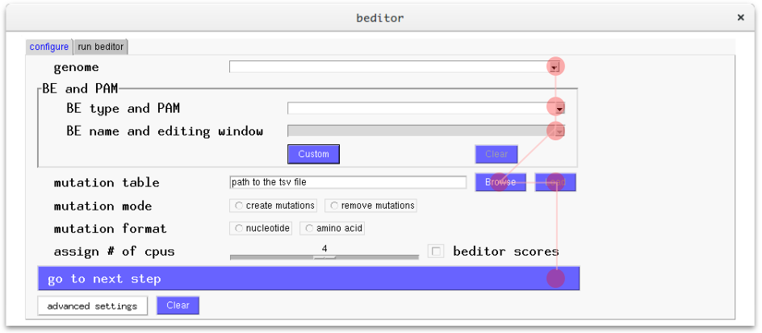
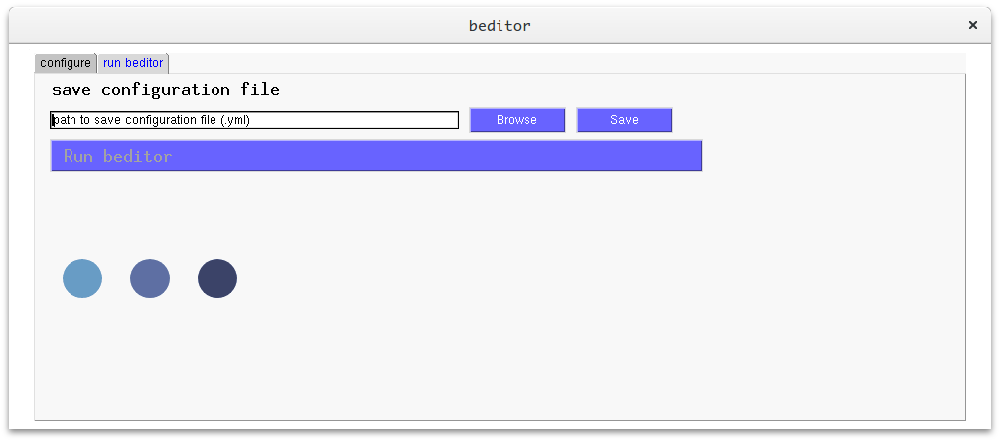
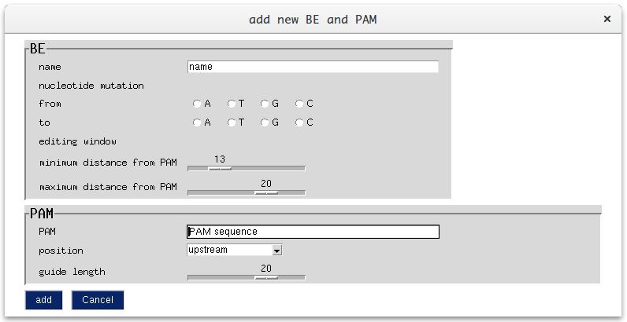

# `beditor`

[](
 https://travis-ci.org/rraadd88/beditor) [](https://pypi.python.org/pypi/beditor)

<!--
pandoc --from=markdown --to=rst --output=README.rst R
EADME.md
-->

A computational workflow for designing libraries of guide RNAs for CRISPR base editing  
Pre-print: https://doi.org/10.1101/426973

Table of Contents
-----------------

1. [Installation](#installation)
2. [Configuration](#configuration-file)
3. [Input format](#input-format)
4. [Output format](#output-format)
5. [API](#api)

Installation
------------
Requirements: [`Anaconda package manager`](https://www.anaconda.com/download/#linux). See [requirements.md](https://github.com/rraadd88/test_beditor/blob/master/requirements.md) for set of bash commands that would install it.

1.  Once all the requirements are satisfied, create a python 3.6 virtual environment.

``` {.sourceCode .text}
wget https://raw.githubusercontent.com/rraadd88/beditor/master/environment.yml
conda env create -f environment.yml
```

2.  Activate the virtual environment.

``` {.sourceCode .text}
source activate beditor
```

3. Install `beditor` python package from pypi.

``` {.sourceCode .text}
pip install beditor
```

Usage
-----

### GUI mode

Open the GUI window from terminal.

``` {.sourceCode .text}
beditor
```

step1: input the configuration settings.  



Note: genomes listed in the gui correspond to ensembl release=95. 

step2: save the configuration settings and run `beditor`. Output will be stored in the directory as the saved configuration settings file (yml file). 



Note: output directory will have the same basename as the saved configuration file. If `/a/b/gene_ed.yml` is the path of the configuration file, the output directory will be `/a/b/gene_ed/`. See [Output format](#output-format) for structure of the output directory.   
Note: see the terminal messages in case of any issue.   

### Command-line mode

1.  Run the analysis.

``` {.sourceCode .text}
beditor --cfg configuration.yml
```

2.  Run a single step in the analysis.

``` {.sourceCode .text}
beditor --step {step number} configuration.yml
```
`step number` and corresponding analysis:

``` {.sourceCode .text}
1: Get genomic loci flanking the target site
2: Get possible mutagenesis strategies
3: Design guides
4: Check offtarget-effects
``` 

3. Help

``` {.sourceCode .text}
beditor --help
```

Input format
------------------


### Table with mutation information.  

Note: Path to this tsv (tab-separated values) file is provided in configuration file as a value for variable called `dinp`. E.g. `dinp: input.tsv`. 

According to the mutation_format opted in configuration.yml file and corresponding columns needed in input.

#### nucleotide : ['genome coordinate','nucleotide mutation'].

Example for *S. cerevisiae* (ensembl genome release=95):

| genome coordinate | nucleotide mutation |
|-------------------|---------------------|
| I:147494-147494-  | A                   |
| I:143607-143607+  | A                   |
| II:369937-369937- | C                   |
| II:372003-372003- | C                   |

#### aminoacid  : ['transcript: id','aminoacid: position','amino acid mutation'].

Example for *S. cerevisiae* (ensembl genome release=95):

| transcript: id | aminoacid: position | amino acid mutation |
|----------------|---------------------|---------------------|
| YAL001C_mRNA   | 18                  | A                   |
| YAL002W_mRNA   | 24                  | A                   |
| YAL019W_mRNA   | 24                  | C                   |
| YAL067W-A_mRNA | 13                  | F                   |
   
Note: genomes listed in the gui correspond to ensembl release=95.   
  
  
### [for command line usage] Configuration file. It contains all the options and paths to files needed by the analysis. 
This YAML formatted file contains the all the analysis specific parameters.

Template:
<https://github.com/rraadd88/test_beditor/blob/master/common/configuration.yml>

```
# Input: Mutation information
## Path to this tsv (tab-separated values) file
dinp: input.tsv
reverse_mutations: False

# Step 1: Extracting sequences flanking mutation site (`01_sequences/`).
## host information
host: scientific name
genomerelease: 93
# check assembly from http://useast.ensembl.org/index.html
genomeassembly: fromensembl


# Step 2: Estimating the editable mutations based on base editors chosen. (`02_mutagenesis/`).
# whether aminoacid or nucleotide mutations
mutation_format: aminoacid or nucleotide
##[N nonsyn] S syn else both
mutation_type: N
## keep nonsense mutations
keep_mutation_nonsense: False
## Mutations information can be provided in 3 options: 
## 1. Required Mutations mentioned in input file. 
## 2. Required Substitutions provided as a file (template: https://github.com/rraadd88/test_beditor/blob/master/common/dsubmap.tsv).
## 3. Carry out Mimetic substitutions (base on genome wide substitution maps). Only for human and yeast.
## input: options 
## mutations: 1, substitutions: 2, mimetic: 3, [no input: keeps all possible mutations (slow)]
mutations: 1
## Parameters specific to above options
## 2. Substitutions provided as a file
dsubmap_preferred_path: 
## 3. Mimetic substitutions
## mimetism level (high: only the best one, [medium: best 5], low: best 10)
mimetism_level: medium
## can not mutate between these 
## if ['S','T','K'] is provided all mutations between thsese amino acids are disallowed
non_intermutables: []


# Step 3: Designed guides (`03_guides/`).
## allowed nucleuotide substitutions per codon
max_subs_per_codon: 1
## base editors to use (restriction max_subs_per_codon would override the choice of base editors)
BEs: ['Target-AID','ABE']
# Cas9 related options
## PAM sequence
pams: ['NGG','NG']

#------------------------------------------------
# System related options 
## Number of cpus/threads
cores: 6
## Number of lines to process per cpu
chunksize: 200
## Dependencies 
## by default the dependencies are installed from the conda environment.
## "optionally" paths to the dependencies could be included below.
bedtools: bedtools
bwa: bwa
samtools: samtools
```


Output format
-------------

``` {.sourceCode .text}
mutation_format opted in configuration.yml file and corresponding columns needed in input: 

nucleotide :  ['genome coordinate','nucleotide wild-type','nucleotide mutation',]
aminoacid : ['transcript: id','aminoacid: wild-type','aminoacid: position','amino acid mutation','codon: wild-type','guide: id','guide+PAM sequence','beditor score','alternate alignments count','CFD score']
```

Format of `guide: id`:

``` {.sourceCode .text}
{genomic locus}|{position of mutation}|({strategy})
where,
strategy= {base editor};{strand};@{distance of mutation from PAM};{PAM};{codon wild-type}:{codon mutation};{amino acid wild-type}:{amino acid mutation};
```

A directory by the basename of configuration file (eg. directory called
'human' if configuration file is 'human.yml') would be created in the
same folder where configuration file is located. It is referred to as
'project directory'.

Inside a project directory there would be following folders named by
corresponding steps of analysis.

``` {.sourceCode .text}
1. 01_sequences/
Stores the output of step #1. Extracting sequences flanking mutation site.
2. 02_mutagenesis/
Stores the output of step #2. Estimating the editable mutations based on base editors chosen.
3. 03_guides/
Stores the output of step #3. Designed guides.
4. 04_offtargets/
Stores the output of step #4. Offtarget effects.
5. 05_outputs/
Stores combined output and visualizations and sets of positive and negative control guides.   
positive control guides are designed so that they introduce stop mutation in genes being targeted.  
begative control guides lack editable nucleotide in the window of maximum activity, thereby supposed to not introduce any mutation.  

Also,
- 00_input/
Stores input files.
- chunks/
If parallel processing is used, this folder would store individual parts (chunks) of the analysis. 
```


How to install custom base editor and PAM
-------------------------------------
### GUI mode

Custom base editor and PAM sequences can be used incorporated in the workflow by selecting 'Custom' option in the 1st tab of the GUI. Following is the layout of the options to input the information about the base editor and the PAM sequence.



### Command-line mode
This information is located in beditor/data (use `which beditor` to locate directory of beditor) directory in tab-separated table format (`dBEs.tsv` and `dpams.tsv`).
In order to install new base editor or PAM, user would have to simply append the relevant information in the tables.

How to run `beditor`
-----------------------------

Example: designing gRNAs to carry out nucleotide mutations in yeast.  
Input [1/2]: Configuration file. It contains all the options and paths to files needed by the analysis. 

```
# Input: Mutation information
## Path to this tsv (tab-separated values) file
dinp: input.tsv
reverse_mutations: false

# Step 1: Extracting sequences flanking mutation site (`01_sequences/`).
## host information
host: saccharomyces_cerevisiae
genomerelease: 92
# check assembly from http://useast.ensembl.org/index.html
genomeassembly: R64-1-1


# Step 2: Estimating the editable mutations based on base editors chosen. (`02_mutagenesis/`).
# whether aminoacid or nucleotide mutations
mutation_format: aminoacid
##[N nonsyn] S syn else both
mutation_type: N
## keep nonsense mutations
keep_mutation_nonsense: False
## Mutations information can be provided in 3 options: 
## 1. Required Mutations mentioned in input file. 
## 2. Required Substitutions provided as a file (template: https://github.com/rraadd88/test_beditor/blob/master/common/dsubmap.tsv).
## 3. Carry out Mimetic substitutions (base on genome wide substitution maps). Only for human and yeast.
## input: options 
## mutations: 1, substitutions: 2, mimetic: 3, [no input: keeps all possible mutations (slow)]
mutations: 1
## Parameters specific to above options
## 2. Substitutions provided as a file
dsubmap_preferred_path: 
## 3. Mimetic substitutions
## mimetism level (high: only the best one, [medium: best 5], low: best 10)
mimetism_level: medium
## can not mutate between these 
## if ['S','T','K'] is provided all mutations between thsese amino acids are disallowed
non_intermutables: []


# Step 3: Designed guides (`03_guides/`).
## allowed nucleuotide substitutions per codon
max_subs_per_codon: 1
## base editors to use (restriction max_subs_per_codon would override the choice of base editors)
BEs: ['Target-AID','ABE']
# Cas9 related options
## PAM sequence
pams: ['NGG','NG']

#------------------------------------------------
# System related options 
## Number of cpus/threads
cores: 6
## Number of lines to process per cpu
chunksize: 200
## Dependencies 
## by default the dependencies are installed from the conda environment.
## "optionally" paths to the dependencies could be included below.
bedtools: bedtools
bwa: bwa
samtools: samtools
```

Input [2/2]: Table with mutation information.  

Note: Path to this tsv (tab-separated values) file is provided in configuration file as a value for variable called `dinp`. E.g. `dinp: input.tsv`. For nucleotide level mutagenesis the column names should be `genome coordinate` and `nucleotide mutation`.

Example:

| genome coordinate | nucleotide mutation |
|-------------------|---------------------|
| II:711491-711491+ | T                   |
| II:712904-712904- | T                   |
| II:714707-714707- | G                   |
| II:716782-716782- | G                   |


How to analyze test datasets
---------------------------

``` {.sourceCode .text}
# make the input files with mock data
git clone https://github.com/rraadd88/test_beditor.git
source activate beditor;cd test_beditor;python test_datasets.py
```

Working with non-ensembl genomes or arbitrary sequences
--------------------------------------------

<https://github.com/openvax/pyensembl#non-ensembl-data>


API
-----

### `beditor.pipeline.collect_chunks`(_cfg_, _chunkcfgps_)[¶](#beditor.pipeline.collect_chunks "Permalink to this definition")

Collects analysed chunks

  

#### Parameters:

*   **cfg** – main configuration dict.
*   **chunkcfgps** – paths to all configuration files of chunks

### `beditor.pipeline.collectchuckfiles`(_cfg_, _fpinchunk_, _force=False_)[¶](#beditor.pipeline.collectchuckfiles "Permalink to this definition")

Collects minor chunk files

  

#### Parameters:

*   **cfg** – configuration dict
*   **fpinchunk** – path inside chuck’s project directory
*   **force** – if True overwrites the outputs

### `beditor.pipeline.main`()[¶](#beditor.pipeline.main "Permalink to this definition")

Provides command-line inputs to the pipeline.

For checking the command-lineinputs,

beditor --help

### `beditor.pipeline.make_outputs`(_cfg_, _plot=True_)[¶](#beditor.pipeline.make_outputs "Permalink to this definition")

Cobines stepwise analysis files into a pretty table.

  

#### Parameters:

*   **cfg** – main configuration dict
*   **plot** – if True creates visualizations

### `beditor.pipeline.pipeline`(_cfgp_, _step=None_, _test=False_, _force=False_)[¶](#beditor.pipeline.pipeline "Permalink to this definition")

Runs steps of the analysis workflow in tandem.

  

#### Parameters:

*   **cfgp** – path to configuration file
*   **step** – step number
*   **test** – if True uses only one core, linear processing with verbose allowed
*   **force** – if True overwrites outputs

### `beditor.pipeline.pipeline_chunks`(_cfgp=None_, _cfg=None_)[¶](#beditor.pipeline.pipeline_chunks "Permalink to this definition")

Runs indivudual chunk.

  

#### Parameters:

*   **cfgp** – path to configuration file.
*   **cfg** – configuration dict

Returns:

### `beditor.pipeline.validcfg`(_cfg_)[¶](#beditor.pipeline.validcfg "Permalink to this definition")

Checks if configuration dict is valid i.e. contains all the required fields

  

#### Parameters:

**cfg** – configuration dict

### `beditor.pipeline.validinput`(_cfg_, _din_)[¶](#beditor.pipeline.validinput "Permalink to this definition")

Checks if input file is valid i.e. contains all the required columns.

  

#### Parameters:

*   **cfg** – configuration dict
*   **din** – dataframe containing input data

### `beditor.configure.get_deps`(_cfg_)[¶](#beditor.configure.get_deps "Permalink to this definition")

Installs dependencies of beditor

  

#### Parameters:

**cfg** – configuration dict

### `beditor.configure.get_genomes`(_cfg_)[¶](#beditor.configure.get_genomes "Permalink to this definition")

Installs genomes

  

#### Parameters:

**cfg** – configuration dict

### `beditor.lib.get_seq.din2dseq`(_cfg_)[¶](#beditor.lib.get_seq.din2dseq "Permalink to this definition")

Wrapper for converting input data (transcript ids and positions of mutation) to seqeunces flanking the codon.

  

#### Parameters:

**cfg** – configuration dict

### `beditor.lib.get_seq.get_seq_aminoacid`(_cfg_, _din_)[¶](#beditor.lib.get_seq.get_seq_aminoacid "Permalink to this definition")

Fetches sequences if mutation format is amino acid

  

#### Parameters:

*   **cfg** – configuration dict
*   **din** – input data

Returns dsequences:

 

dataframe with sequences

### `beditor.lib.get_seq.get_seq_nucleotide`(_cfg_, _din_)[¶](#beditor.lib.get_seq.get_seq_nucleotide "Permalink to this definition")

Fetches sequences if mutation format is nucleotide

  

#### Parameters:

*   **cfg** – configuration dict
*   **din** – input data

Returns dsequences:

 

dataframe with sequences

### `beditor.lib.get_seq.t2pmapper`(_t_, _coding\_sequence\_positions_)[¶](#beditor.lib.get_seq.t2pmapper "Permalink to this definition")

Maps transcript id with protein id.

  

#### Parameters:

*   **t** – pyensembl transcript object
*   **t** – reading frames

Returns coding\_sequence\_positions:

 

dataframe with mapped positions

### `beditor.lib.get_seq.tboundaries2positions`(_t_)[¶](#beditor.lib.get_seq.tboundaries2positions "Permalink to this definition")

Fetches positions from transcript boundaries.

  

#### Parameters:

**t** – pyensembl transcript object

Returns coding\_sequence\_positions:

 

reading frames

### `beditor.lib.get_mutations.dseq2dmutagenesis`(_cfg_)[¶](#beditor.lib.get_mutations.dseq2dmutagenesis "Permalink to this definition")

Generates mutagenesis strategies from identities of reference and mutated codons (from dseq).

  

#### Parameters:

**cfg** – configurations from yml file

### `beditor.lib.get_mutations.filterdmutagenesis`(_dmutagenesis_, _cfg_)[¶](#beditor.lib.get_mutations.filterdmutagenesis "Permalink to this definition")

Filters the mutagenesis strategies by multiple options provided in configuration file (.yml).

  

#### Parameters:

*   **dmutagenesis** – mutagenesis strategies (pd.DataFrame)
*   **cfg** – configurations from yml file

### `beditor.lib.get_mutations.get_codon_table`(_aa_, _tax\_id=None_)[¶](#beditor.lib.get_mutations.get_codon_table "Permalink to this definition")

Gets host specific codon table.

  

#### Parameters:

*   **aa** – list of amino acids
*   **host** – name of host

Returns:

codon table (pandas dataframe)

### `beditor.lib.get_mutations.get_codon_usage`(_cuspp_)[¶](#beditor.lib.get_mutations.get_codon_usage "Permalink to this definition")

Creates codon usage table.

  

#### Parameters:

**cuspp** – path to cusp generated file

Returns:

codon usage table (pandas dataframe)

### `beditor.lib.get_mutations.get_possible_mutagenesis`(_dcodontable_, _dcodonusage_, _BEs_, _pos\_muts_, _host_)[¶](#beditor.lib.get_mutations.get_possible_mutagenesis "Permalink to this definition")

Assesses possible mutagenesis strategies, given the set of Base editors and positions of mutations.

  

#### Parameters:

*   **dcodontable** – Codon table
*   **dcodonusage** – Codon usage table
*   **BEs** – Base editors (dict), see global\_vars.py
*   **pos\_muts** – positions of mutations
*   **host** – host organism

Returns:

possible mutagenesis strategies as a pandas dataframe

### `beditor.lib.get_mutations.get_submap`(_cfg_)[¶](#beditor.lib.get_mutations.get_submap "Permalink to this definition")

Fetches mimetic substitution map that would be used to filter mutagenesis strategies.

  

#### Parameters:

**cfg** – configurations from yml file.

### `beditor.lib.make_guides.dinnucleotide2dsequencesproper`(_dsequences_, _dmutagenesis_, _dbug=False_)[¶](#beditor.lib.make_guides.dinnucleotide2dsequencesproper "Permalink to this definition")

Makes dseqeunces dataframe of nucleotide mutation format compatible to guide design modules

  

#### Parameters:

*   **dsequences** – dsequences dataframe
*   **dmutagenesis** – dmutagenesis dataframe

### `beditor.lib.make_guides.dpam2dpam_strands`(_dpam_, _pams_)[¶](#beditor.lib.make_guides.dpam2dpam_strands "Permalink to this definition")

Duplicates dpam dataframe to be compatible for searching PAMs on - strand

  

#### Parameters:

*   **dpam** – dataframe with pam information
*   **pams** – pams to be used for actual designing of guides.

### `beditor.lib.make_guides.dseq2dguides`(_cfg_)[¶](#beditor.lib.make_guides.dseq2dguides "Permalink to this definition")

Wrapper around make guides function.

  

#### Parameters:

**cfg** – configuration dict.

### `beditor.lib.make_guides.get_pam_searches`(_dpam_, _seq_, _pos\_codon_, _test=False_)[¶](#beditor.lib.make_guides.get_pam_searches "Permalink to this definition")

Search PAM occurance

  

#### Parameters:

*   **dpam** – dataframe with PAM sequences
*   **seq** – target sequence
*   **pos\_codon** – reading frame
*   **test** – debug mode on

Returns dpam\_searches:

 

dataframe with positions of pams

### `beditor.lib.make_guides.guide2dpositions`(_x_, _dbug=False_)[¶](#beditor.lib.make_guides.guide2dpositions "Permalink to this definition")

Get positions of guides relative to the target site and PAM sequence Note: Index and flank sequence based indexing are 0-based Distances and positions from pam are 1-based

  

#### Parameters:

**x** – lambda section of dguides dataframe

### `beditor.lib.make_guides.make_guides`(_cfg_, _dseq_, _dmutagenesis_, _dpam_, _test=False_, _dbug=False_)[¶](#beditor.lib.make_guides.make_guides "Permalink to this definition")

Wrapper around submodules that design guides by 1. searching all PAM sequences on ‘both’ the strands, 2. filtering guides by all possible strategies (given in dmutagenesis) e.g. activity window, Finally generates a table.

  

#### Parameters:

*   **cfg** – configuration dict
*   **dseq** – dsequences dataframe
*   **dmutagenesis** – dmutagenesis dataframe
*   **dpam** – dpam dataframe
*   **test** – debug mode on
*   **dbug** – more verbose

### `beditor.lib.get_specificity.alignmentbed2dalignedfasta`(_cfg_)[¶](#beditor.lib.get_specificity.alignmentbed2dalignedfasta "Permalink to this definition")

Get sequences in FASTA format from BED file step#5

  

#### Parameters:

**cfg** – configuration dict

### `beditor.lib.get_specificity.dalignbed2annotationsbed`(_cfg_)[¶](#beditor.lib.get_specificity.dalignbed2annotationsbed "Permalink to this definition")

Get annotations from the aligned BED file step#3

  

#### Parameters:

**cfg** – configuration dict

### `beditor.lib.get_specificity.dalignbed2dalignbedguides`(_cfg_)[¶](#beditor.lib.get_specificity.dalignbed2dalignbedguides "Permalink to this definition")

Get guide seqeunces from the BED file step#4

  

#### Parameters:

**cfg** – configuration dict

### `beditor.lib.get_specificity.dalignbed2dalignbedguidesseq`(_cfg_)[¶](#beditor.lib.get_specificity.dalignbed2dalignbedguidesseq "Permalink to this definition")

Get sequences from BED file step#6

  

#### Parameters:

**cfg** – configuration dict

### `beditor.lib.get_specificity.dalignbedannot2daggbyguide`(_cfg_)[¶](#beditor.lib.get_specificity.dalignbedannot2daggbyguide "Permalink to this definition")

Aggregate annotations per alignment to annotations per guide. step#10

  

#### Parameters:

**cfg** – configuration dict

### `beditor.lib.get_specificity.dalignbedguidesseq2dalignbedstats`(_cfg_)[¶](#beditor.lib.get_specificity.dalignbedguidesseq2dalignbedstats "Permalink to this definition")

Gets scores for guides step#7

  

#### Parameters:

**cfg** – configuration dict

### `beditor.lib.get_specificity.dannots2dalignbed2dannotsagg`(_cfg_)[¶](#beditor.lib.get_specificity.dannots2dalignbed2dannotsagg "Permalink to this definition")

Aggregate annotations per guide step#8

  

#### Parameters:

**cfg** – configuration dict

### `beditor.lib.get_specificity.dannotsagg2dannots2dalignbedannot`(_cfg_)[¶](#beditor.lib.get_specificity.dannotsagg2dannots2dalignbedannot "Permalink to this definition")

Map aggregated annotations to guides step#9

  

#### Parameters:

**cfg** – configuration dict

### `beditor.lib.get_specificity.dguides2guidessam`(_cfg_, _dguides_)[¶](#beditor.lib.get_specificity.dguides2guidessam "Permalink to this definition")

Aligns guides to genome and gets SAM file step#1

  

#### Parameters:

*   **cfg** – configuration dict
*   **dguides** – dataframe of guides

### `beditor.lib.get_specificity.dguides2offtargets`(_cfg_)[¶](#beditor.lib.get_specificity.dguides2offtargets "Permalink to this definition")

All the processes in offtarget detection are here.

  

#### Parameters:

**cfg** – Configuration settings provided in .yml file

### `beditor.lib.get_specificity.guidessam2dalignbed`(_cfg_)[¶](#beditor.lib.get_specificity.guidessam2dalignbed "Permalink to this definition")

Processes SAM file to get the genomic coordinates in BED format step#2

  

#### Parameters:

**cfg** – configuration dict
